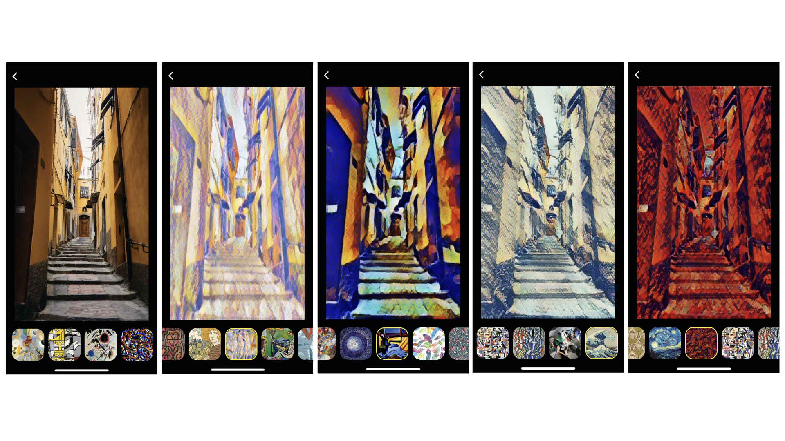
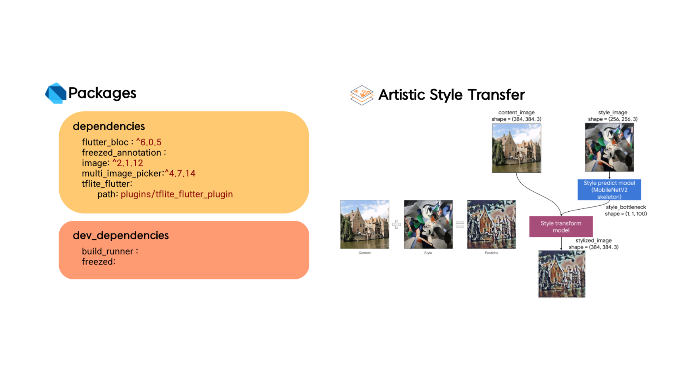

# Flutter Tensorflow Lite Style Transfer

# 开发注意
```
1. 大部分包升级为NullSafe版本, 使用了Dart新NullSafe语法需要Dart在2.12.0以上
2. tflite_flutter还有未完成NullSafe的依赖（等待下次更新 先在flutter 后加--no-sound-null-safety 解决编译问题
```
Artistic Style Transfer with TensorFlow Lite
<p align="center">

</p>

<p align="center">
 
</p>

<p align="center">
 
</p>

## TFLite Package Initial setup
To use the tflite model, follow the guide on the page below.    
- https://pub.dev/packages/tflite_flutter#important-initial-setup
To use the tflite model , follow the guide on the page below.
- https://pub.dev/packages/rflite_flutter#imporant-inital-setupz
## Reference
* About Style Transfer : https://www.tensorflow.org/lite/models/style_transfer/overview
* About Origin Project : https://github.com/PuzzleLeaf/flutter_tflite_style_transfer
## Packages
* flutter_bloc : https://pub.dev/packages/flutter_bloc

* freezed : https://pub.dev/packages/freezed

* freezed_annotation : https://pub.dev/packages/freezed_annotation

* build_runner : https://pub.dev/packages/build_runner

* image : https://pub.dev/packages/image

* multi_image_picker : https://pub.dev/packages/multi_image_picker

* tflite_flutter : https://pub.dev/packages/tflite_flutter    

# Data Structure

### History table
|field|type|description|
| --- | --- | --- |
|id|int|uuid|
|time|Datetime|Generate time|
|content|text|Base64ed image data|
