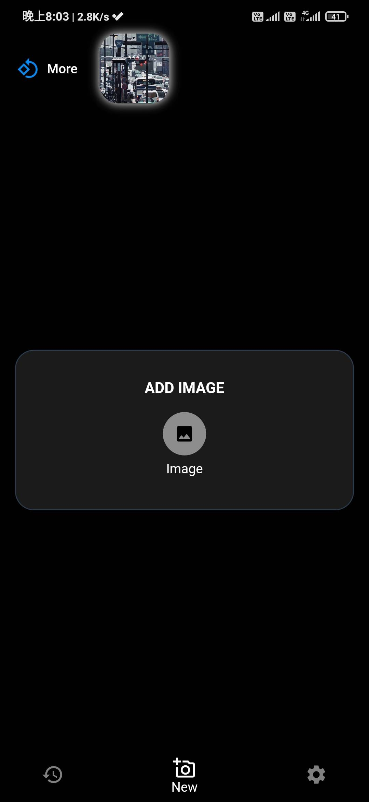
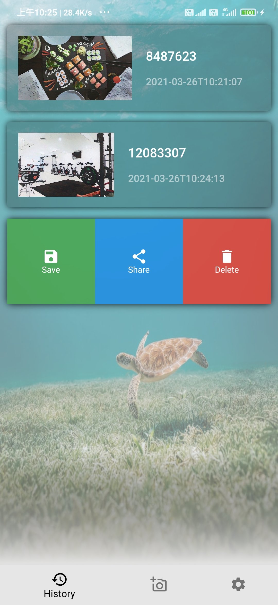
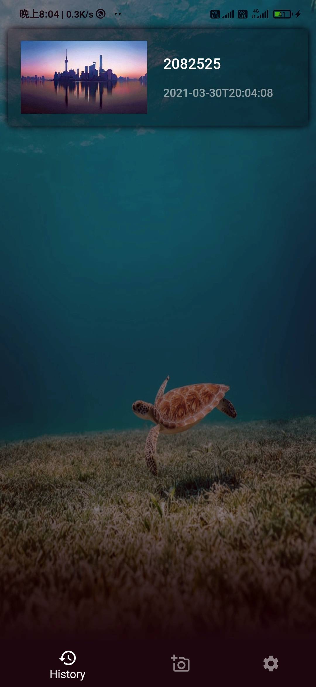
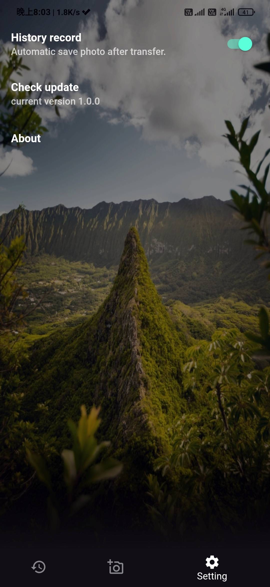

# Flutter Style Transfer

# Feature
- ✨ 集成多种风格转换模型
- 💾 保存到图库
- 📤 一键分享
- 🌓 适配深色模式的主题

Light             |  Dark
:-------------------------:|:-------------------------:
  | 
  | 
  | 
## Reference
* About Model : 
    * [arbitrary-image-stylization](https://tfhub.dev/google/lite-model/magenta/arbitrary-image-stylization-v1-256/int8/prediction/1) 
    * [CartoonGAN](https://tfhub.dev/sayakpaul/lite-model/cartoongan/int8/1)
* About Related Efforts : [PuzzleLeaf/flutter_tflite_style_transfer](https://github.com/PuzzleLeaf/flutter_tflite_style_transfer)

